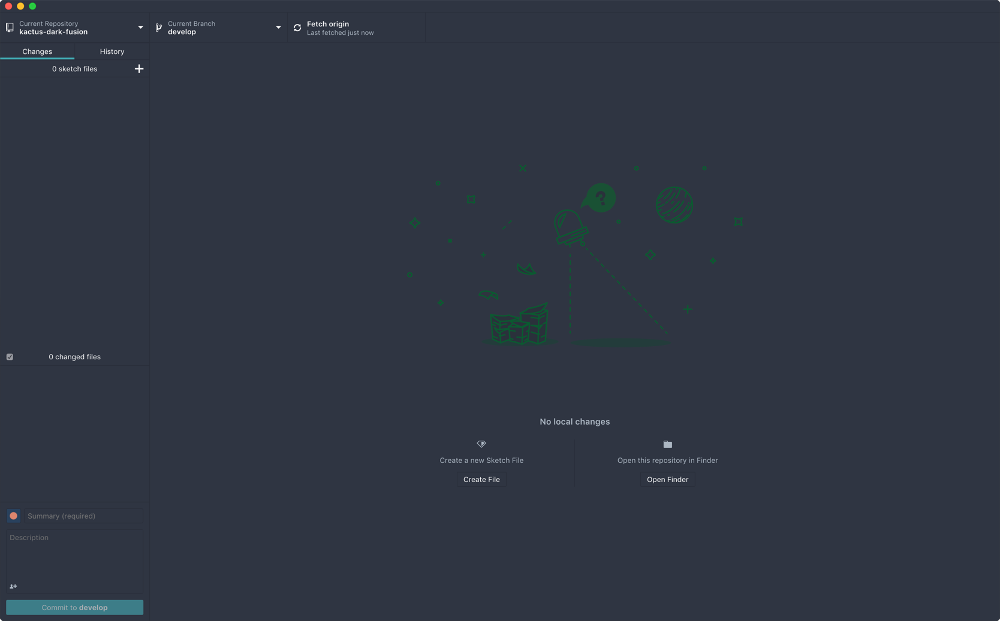

<h1 align="center">
  <a href="./assets/icon.png"></a>
  <br>
  <br>
  Kactus Dark Fusion Theme
</h1>

<h4 align="center">Dark Fusion Theme for Kactus macOS app</h4>

<p align="center">
  <a href="./kactus--dark-fusion.png"></a>
  <a href="https://github.com/typerror/kactus-dark-fusion/releases"></a>
  <a href="https://github.com/typerror/kactus-dark-fusion/license"></a><br>
</p>

### Install

This theme will override your **currently selected** theme.

At the moment it has been tested on macOS High Sierra and Mojave 10.14

1. Open Kactus Dekstop
2. Open the devtools with **View > Toggle developer tools** (or <kbd>Cmd+alt+I</kbd>)
3. Paste in the following into the **Console** and hit <kbd>Enter</kbd>:
```js
const fs = require('fs');
const path = require('path');
const res = process.resourcesPath;

let html_file_path;
if (fs.existsSync(path.join(res, 'app/index.html'))) {
	html_file_path = path.join(res, 'app/index.html');
} else if (fs.existsSync(path.join(res, 'app/dist/index.html'))) {
	html_file_path = path.join(res, 'app/dist/index.html');
} else {
	throw new Error(`Couldn't find index.html`);
}

let html = fs.readFileSync(html_file_path, "utf8");

const link_to_inject = '  <link href="https://cdn.jsdelivr.net/gh/typerror/kactus-dark-fusion@v0.2-alpha/kactus--dark-fusion.css" rel="stylesheet">';
html = html
	.replace(/<link[^>]+(cdn|custom-theme)[^>]+>/, '') // remove existing custom stylesheet if there is one
	.replace('</head>', `\n${link_to_inject}</head>`); // add stylesheet

try {
	fs.writeFileSync(html_file_path, html, 'utf8');
} catch(error) {
	if (html_file_path.startsWith('/tmp')) {
		console.error(`The theme cannot be applied to the AppImage since 'index.html' is saved in a temporary directory.`)
	} else if (error.code == 'EACCES') {
		console.error(`You need to have write access to '${html_file_path}' for the theme to be applied.`)
	}
	throw error;
}

// clear the cache so the stylesheet can update (could alternatively cache-bust with a URL parameter)
const {remote} = require('electron');
const win = remote.getCurrentWindow();
win.webContents.session.clearCache(() => {
	if (confirm('Ready to refresh? :)')) {
		location.reload();
	}
});
```

Kactus Desktop will refresh and the theme should be applied.

You'll need to reapply the stylesheet when Kactus Desktop updates.ù

<h2>
  <a href="./assets/kactus--dark-fusion.png"></a>
</h2>


### Code Style

[](https://github.com/prettier/prettier)


### License

Kactus Dark Fusion Theme is not affiliated with Kactus. All other trademarks and copyrights are property of their respective owners.


MIT. Copyright (c) [typerror](https://github.com/typerror)

